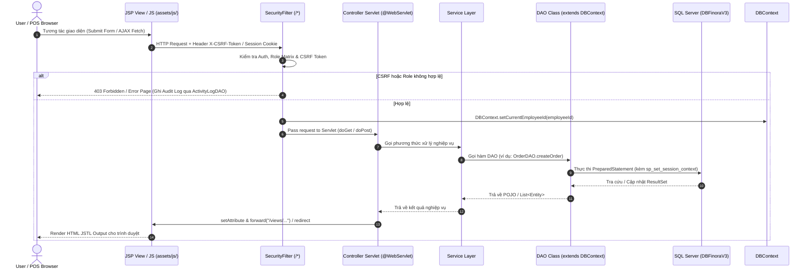

# Quy Tắc Và Hợp Đồng Kiến Trúc Cho Agent AI — AGENTS.md

> **Tên dự án:** SWP391_Finora (FinoraRetail)  
> **Phạm vi:** Hợp đồng kiến trúc, quy tắc phát triển và chỉ dẫn làm việc bắt buộc cho tất cả các AI Agent & Lập trình viên trong dự án.  
> **Phiên bản:** 3.0 (Cập nhật chuẩn xác 100% dựa theo `src/` và `DBFinoraV3`)  
> **Mã hóa:** UTF-8 without BOM  

---

## 1. Môi Trường & Công Nghệ Yêu Cầu

| Thành phần | Thông số thực tế trong `pom.xml` & `src/` |
|---|---|
| **Môi trường phát triển** | JDK 17 (Java SE 17) |
| **Servlet Standard** | Jakarta Servlet API 6.0.0 (Jakarta EE 10) |
| **JSP & JSTL** | Jakarta Servlet JSP JSTL API 3.0.0 & GlassFish JSTL 3.0.1 |
| **Web Server** | Apache Tomcat 10.1+ |
| **Cơ sở dữ liệu** | Microsoft SQL Server (Database: `DBFinoraV3`) |
| **Script CSDL** | `docs/3_DATABASE/Finora.sql` (Chứa `CREATE DATABASE [DBFinoraV3]`) |
| **JDBC Connection Utility** | `util.database.DBContext` (Hỗ trợ biến môi trường `DB_URL`, `DB_USER`, `DB_PASSWORD`) |
| **Bảo mật & Mã hóa** | `jbcrypt` 0.4 (Mật khẩu BCrypt), CSRF Tokens, Security Headers, Audit Session Context (`sp_set_session_context`) |
| **Thư viện tích hợp** | OpenPDF 1.3.39 (Xuất PDF), Apache POI 5.2.5 (Import/Export Excel), Jakarta Mail 2.0.1 (Email SMTP), VNPay SDK |
| **Kiểm thử** | JUnit 5 (JUnit Jupiter 5.10.1) |
| **Build Tool** | Maven 3.x (`target/StoreManagementNetBeans.war`) |

---

## 2. Cấu Trúc Mã Nguồn Thực Tế (`src/main/java`)

> **LƯU Ý QUAN TRỌNG:** Package root nằm trực tiếp ở các gói cấp cao dưới `src/main/java/` (KHÔNG sử dụng tiền tố `com.storemanagement`).

```
src/main/java/
├── constant/                  # Các hằng số toàn ứng dụng (AppConstants.java)
├── controller/                # Tầng điều hướng Http Servlet (Phân theo domain)
│   ├── auth/                  # AuthServlet.java (/login, /logout, /forgot-password)
│   ├── branch/                # BranchController.java
│   ├── common/                # BaseController.java (Helper forward, redirect, session)
│   ├── customer/              # CustomerController.java
│   ├── dashboard/             # DashboardController.java
│   ├── finance/               # IncomeExpenseController.java, PaymentInvoiceController.java
│   ├── inventory/             # ApprovalTabController, HistoryController, InventoryBaseController, InventoryCheckController, InventoryController, OrderVoucherController, PendingVouchersController, StockController, TransferController
│   ├── pos/                   # PosController, CartServlet, CheckoutServlet
│   ├── product/               # ProductController, CategoryServlet
│   ├── purchase/              # PurchaseOrderController
│   ├── report/                # ReportController
│   ├── sales/                 # RevenueServlet, SalesServlet, ShiftServlet
│   ├── supplier/              # SupplierServlet
│   ├── system/                # ActivityLogController, SystemController
│   ├── user/                  # AdminUserServlet, ManagerEmployeeServlet, OwnerUserServlet, ProfileServlet
│   ├── vnpay/                 # VNPayServlet, VNPayResultServlet, VNPayReturnServlet
│   ├── warehouse/             # WarehouseController
│   └── website/               # StaticPageController
├── dao/                       # Tầng truy xuất dữ liệu SQL Server (Kế thừa DBContext)
│   ├── branch/                # BranchDAO
│   ├── common/                # ICrudDAO
│   ├── customer/              # CustomerDAO
│   ├── dashboard/             # DashboardDAO
│   ├── employee/              # EmployeeDAO
│   ├── finance/               # IncomeExpenseDAO, PaymentInvoiceDAO
│   ├── inventory/             # InventoryDAO, StockTransferDAO, InventoryCheckDAO
│   ├── product/               # ProductDAO, CategoryDAO
│   ├── purchase/              # PurchaseOrderDAO
│   ├── report/                # ReportDAO
│   ├── sales/                 # OrderDAO, SalesDAO, ShiftDAO
│   ├── supplier/              # SupplierDAO
│   ├── system/                # ActivityLogDAO, VatSettingDAO
│   └── user/                  # ProfileDao, UserManagementDao
├── dto/                       # Data Transfer Objects (inventory DTOs, report filters)
├── filter/                    # SecurityFilter.java (Bộ lọc bảo mật central /*)
├── model/                     # 51 Domain POJO Entities
│   ├── ActivityLog, AuditLog, Branch, BranchKpi, CartItem, CashTransaction, Category
│   ├── Customer, CustomerOverview, DashboardOverview, Employee, EmployeeKpi, EmployeeOverview
│   ├── EmployeeRoleOption, EmployeeSalesSummary, ExpenseVoucher, Inventory, InventoryCheck
│   ├── InventoryCheckDetail, InventoryItem, InventoryReportItem, InventoryReportOverview, Invoice
│   ├── LoyalCustomerOverview, LoyalCustomerSummary, LoyaltyPointSetting, Order, OrderDetail
│   ├── OrderReportFilter, OrderReportKpi, OrderTab, Payment, Product, PurchaseDetail, PurchaseOrder
│   ├── ReceiptVoucher, RevenueSummary, Role, SalesTransaction, SalesTransactionFilter
│   ├── SalesTransactionKpi, Shift, StockTransaction, StockTransfer, StockTransferDetail
│   ├── Supplier, SupplierProduct, Unit, VatSetting, Voucher, Warehouse
├── service/                   # Tầng Nghiệp vụ trung gian (customer, employee, finance, inventory, purchase, supplier, system, vnpay)
└── util/                      # Các tiện ích hệ thống
    ├── database/              # DBContext.java (kết nối DBFinoraV3), DatabaseMigrationListener.java
    ├── security/              # PasswordUtil.java (BCrypt)
    ├── email/                 # EmailUtil.java
    ├── finance/               # MoneyUtil.java
    ├── inventory/             # ExcelImportUtil, StockCalculator
    ├── pagination/            # PageUtil.java
    ├── report/                # ReportExportUtil.java
    ├── validation/            # ValidationUtil.java
    └── vnpay/                 # VNPayConfig.java
```

---

## 3. Kiến Trúc Luồng Chi Tiết (JSP ➔ JS ➔ Java Controller ➔ Service ➔ DAO ➔ DB)



---

## 4. Bảo Mật & RBAC (`SecurityFilter`)

Hệ thống bảo vệ toàn bộ ứng dụng qua `filter.SecurityFilter` (`urlPatterns = {"/*"}`):

### 4.1. Phân Quyền Role Matrix (`ROLE_MAP`)
- `/system/*`, `/admin/*`, `/configuration/*`, `/activity/*` ➔ `admin`, `owner`
- `/management/*`, `/manager/*`, `/branch` ➔ `admin`, `owner`, `storemanager`
- `/inventory/*`, `/warehouse/*`, `/product/*`, `/products`, `/supplier`, `/purchase/*` ➔ `admin`, `owner`, `storemanager`, `warehousestaff`
- `/pos/*`, `/customer/*`, `/sales/*`, `/cart/*`, `/checkout/*`, `/orders/*`, `/shift/*` ➔ `admin`, `owner`, `storemanager`, `salesstaff`
- `/owner/*` ➔ `admin`, `owner`, `storemanager`, `salesstaff`, `warehousestaff`

### 4.2. Đường Dẫn Công Khai (`PUBLIC_PATHS`)
- `/login`, `/logout`, `/forgot-password`, `/register`, `/role-selection`
- `/assets/*`, `/css/*`, `/js/*`, `/static/*`
- `/vnpay/ipn`, `/vnpay/return`, `/order/status`

### 4.3. Các Tính Năng Bảo Mật Bắt Buộc
- **CSRF Token:** Sinh token ngẫu nhiên trong session và kiểm tra trên tất cả request `POST` (nhận tham số `csrfToken` hoặc header `X-CSRF-Token` / `X-Csrf-Token`).
- **Audit Logging:** Tự động ghi log thất bại hoặc truy cập trái phép qua `ActivityLogDAO`.
- **Security Headers:** Đặt `Cache-Control: no-cache, no-store`, `X-Frame-Options: DENY`, `X-Content-Type-Options: nosniff`, `Referrer-Policy: same-origin`.
- **Database Audit Session Context:** Gọi `DBContext.setCurrentEmployeeId(empId)` thiết lập `sp_set_session_context N'EmployeeID', empId` cho DB Triggers.

---

## 5. Quy Tắc Phát Triển & Code Standards

1. **Truy xuất Database**:
   - **BẮT BUỘC** kết nối database `DBFinoraV3`.
   - **BẮT BUỘC** sử dụng `PreparedStatement` với tham số `?` để chống SQL Injection.
   - **BẮT BUỘC** giải phóng kết nối qua `try-with-resources` (`Connection`, `PreparedStatement`, `ResultSet`).
   - KHÔNG ĐƯỢC viết câu lệnh SQL trong Controller hoặc JSP View.

2. **Tầng Servlet & Controller**:
   - Khai báo route bằng annotation `@WebServlet(name = "...", urlPatterns = {"/path"})`.
   - Kế thừa `controller.common.BaseController` hoặc `HttpServlet`.
   - Chuyển tiếp view bằng `req.getRequestDispatcher("/views/module/page.jsp").forward(req, resp)`.

3. **Giao Diện JSP & Asset**:
   - Toàn bộ view đặt trong `src/main/webapp/views/`.
   - Dùng JSTL (`<c:forEach>`, `<c:if>`, `<c:out>`), KHÔNG sử dụng Java scriptlets (`<% %>`).
   - Encode HTML output để chống XSS.

4. **Mã Hóa & Format**:
   - Lưu trữ tất cả file text dưới chuẩn **UTF-8 without BOM**.
   - Thư mục build output (`target/`, `.smarttomcat/`) KHÔNG ĐƯỢC CHỈNH SỬA TRỰC TIẾP.

---

## 6. Quy Trình Xác Minh Bắt Buộc (Verification Pipeline)

Sau khi chỉnh sửa mã nguồn Java hoặc file cấu hình:

```powershell
mvn clean package -DskipTests
```

- Lệnh build Maven phải thành công (`BUILD SUCCESS`).
- Cập nhật tài liệu tương ứng trong `docs/` ngay trong cùng commit.
