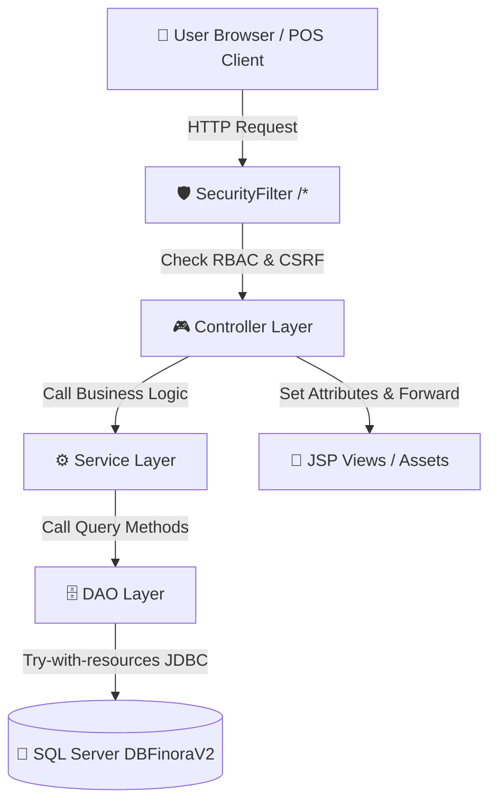

<div align="center">

# 🛒 FinoraRetail (SWP391_Finora)

### *Hệ Thống Quản Lý Bán Lẻ & Chuỗi Cửa Hàng Đa Chi Nhánh Thế Hệ Mới*

[](https://www.oracle.com/java/)
[](https://jakarta.ee/)
[](https://tomcat.apache.org/)
[](https://www.microsoft.com/sql-server)
[](https://maven.apache.org/)
[](#-kiến-trúc-bảo-mật--rbac)

---

[🚀 Quickstart](#-hướng-dẫn-cài-đặt--vận-hành) • [✨ Tính Năng Nổi Bật](#-tính-năng-nổi-bật) • [🏗 Kiến Trúc Hệ Thống](#-kiến-trúc-hệ-thống--mã-nguồn) • [🔒 Bảo Mật & RBAC](#-kiến-trúc-bảo-mật--rbac) • [📚 Tài Liệu Hướng Dẫn](#-bộ-tài-liệu-dự-án-docs)

</div>

---

## 📖 Giới Thiệu Dự Án

**FinoraRetail** (`SWP391_Finora`) là giải pháp phần mềm quản trị doanh nghiệp bán lẻ (ERP / POS / WMS) toàn diện, được thiết kế cho các chuỗi cửa hàng đa chi nhánh. Hệ thống xử lý mượt mà toàn bộ quy trình từ **Bán hàng POS tại quầy**, **Thanh toán điện tử VNPay**, **Quản lý kho bãi & điều chuyển hàng hóa**, **Báo cáo doanh thu tài chính**, đến **Quản lý phân quyền tài khoản & lịch sử hoạt động**.

Ứng dụng được xây dựng chuẩn mực theo mô hình kiến trúc **MVC + DAO + Service Layer**, tối ưu hiệu năng trên nền Java 17 và Jakarta Servlet 6.0 (Tomcat 10.1+), kết nối cơ sở dữ liệu **Microsoft SQL Server**.

---

## ✨ Tính Năng Nổi Bật

<table>
  <tr>
    <td width="50%">
      <h3>🏬 Quản Lý Đa Chi Nhánh & Kho Bãi</h3>
      <ul>
        <li><b>Điều chuyển tồn kho (Stock Transfer):</b> Luồng đề xuất, phê duyệt và xác nhận nhập kho giữa các chi nhánh.</li>
        <li><b>Kiểm kê định kỳ (Stocktaking):</b> Cân bằng kho, đối soát chênh lệch giữa số lượng thực tế và hệ thống.</li>
        <li><b>Phân quyền kho (Receipt Isolation):</b> Cách ly dữ liệu phiếu nhập/xuất kho theo đúng chi nhánh được phân công.</li>
      </ul>
    </td>
    <td width="50%">
      <h3>💳 Bán Hàng POS & Thanh Toán VNPay</h3>
      <ul>
        <li><b>Màn hình POS tối ưu:</b> Tìm kiếm sản phẩm siêu tốc, quản lý giỏ hàng realtime, áp dụng voucher giảm giá.</li>
        <li><b>Cổng thanh toán VNPay:</b> Tích hợp mã QR VNPay, checksum hashing, tự động xử lý IPN & Return callback.</li>
        <li><b>In hóa đơn & Đơn hàng:</b> Tự động tính thuế VAT, điểm thưởng tích lũy cho khách hàng thân thiết.</li>
      </ul>
    </td>
  </tr>
  <tr>
    <td width="50%">
      <h3>📊 Báo Cáo Tài Chính & Doanh Thu</h3>
      <ul>
        <li><b>Thống kê kinh doanh:</b> Biểu đồ KPI doanh thu, chi phí, lợi nhuận theo từng ca làm việc (Shift) và chi nhánh.</li>
        <li><b>Xuất báo cáo đa định dạng:</b> Xuất dữ liệu Excel chuẩn với <b>Apache POI 5.2.5</b> và tệp PDF với <b>OpenPDF 1.3.39</b>.</li>
        <li><b>Sổ nhật ký thu chi:</b> Quản lý chi tiết phiếu thu, phiếu chi, hóa đơn thanh toán.</li>
      </ul>
    </td>
  </tr>
  <tr>
    <td width="50%">
      <h3>🛡 Phân Quyền Vẫn Vận & Audit Log</h3>
      <ul>
        <li><b>Ma trận phân quyền (RBAC):</b> 5 nhóm vai trò chi tiết: <code>Owner</code>, <code>Admin</code>, <code>StoreManager</code>, <code>WarehouseStaff</code>, <code>SalesStaff</code>.</li>
        <li><b>Bảo mật toàn diện:</b> Mã hóa mật khẩu BCrypt, chống tấn công CSRF, cấu hình Security Headers chống XSS/Framing.</li>
        <li><b>Nhật ký hoạt động (Activity Log):</b> Ghi vết tự động mọi thao tác hệ thống và cảnh báo truy cập trái phép.</li>
      </ul>
    </td>
  </tr>
</table>

---

## 🛠 Công Nghệ Sử Dụng

### Backend & Core Frameworks
* **Ngôn ngữ:** Java SE 17 (JDK 17)
* **Web Standard:** Jakarta Servlet API 6.0.0 (Jakarta EE 10) & JSP JSTL 3.0
* **Web Server:** Apache Tomcat 10.1+
* **Build Tool:** Apache Maven 3.x

### Database & Libraries
* **Cơ sở dữ liệu:** Microsoft SQL Server (`DBFinoraV2`)
* **JDBC Driver:** `mssql-jdbc` 12.6.1.jre11
* **Mã hóa mật khẩu:** `jbcrypt` 0.4 (BCrypt Hashing)
* **Xử lý Excel:** Apache POI 5.2.5 (`poi` & `poi-ooxml`)
* **Xử lý PDF:** OpenPDF 1.3.39
* **Email SMTP:** Jakarta Mail 2.0.1
* **Kiểm thử:** JUnit 5 Jupiter 5.10.1

---

## 🏗 Kiến Trúc Hệ Thống & Mã Nguồn

Ứng dụng tuân thủ nghiêm ngặt mô hình kiến trúc phân lớp **MVC + DAO + Service Layer**. Mọi gói mã nguồn Java nằm trực tiếp tại `src/main/java/`:



### 📁 Tổ Chức Thu Mục Mã Nguồn (`src/main/java/`)

```text
src/main/java/
├── constant/          # Hằng số toàn ứng dụng (AppConstants.java)
├── controller/        # 30+ Servlets xử lý HTTP Requests (phân theo domain)
│   ├── auth/          # AuthServlet.java (/login, /logout, /forgot-password)
│   ├── branch/        # BranchController.java
│   ├── customer/      # CustomerController.java
│   ├── dashboard/     # DashboardController.java
│   ├── finance/       # IncomeExpenseController, PaymentInvoiceController
│   ├── inventory/     # StockController, TransferController, InventoryCheckController...
│   ├── pos/           # PosController, CartServlet, CheckoutServlet
│   ├── product/       # ProductController, CategoryServlet
│   ├── sales/         # SalesServlet, RevenueServlet, ShiftServlet
│   ├── system/        # ActivityLogController, SystemController
│   ├── user/          # AdminUserServlet, OwnerUserServlet, ManagerEmployeeServlet...
│   └── vnpay/         # VNPayServlet, VNPayResultServlet, VNPayReturnServlet
├── dao/               # Data Access Objects (truy vấn SQL Server, kế thừa DBContext)
├── dto/               # Data Transfer Objects (inventory DTOs, report DTOs)
├── filter/            # SecurityFilter.java (Bộ lọc bảo mật central /*)
├── model/             # 51 Domain POJO Entities (Product, Order, Employee, Inventory...)
├── service/           # Tầng nghiệp vụ trung gian (customer, inventory, finance, system...)
└── util/              # Tiện ích hệ thống (DBContext, PasswordUtil, ExcelImportUtil, MoneyUtil...)
```

---

## 🔒 Kiến Trúc Bảo Mật & RBAC

Bảo mật ứng dụng được quản lý tập trung qua **`filter.SecurityFilter`** (`urlPatterns = {"/*"}`):

### 1. Phân Quyền Role Matrix (`ROLE_MAP`)
| Đường dẫn URL | Vai trò được phép truy cập |
|---|---|
| `/system/*` | `admin`, `owner` |
| `/management/*` | `admin`, `owner`, `storemanager`, `warehousestaff` |
| `/pos/*` | `admin`, `owner`, `storemanager`, `salesstaff` |
| `/owner/*` | `owner`, `storemanager`, `salesstaff`, `warehousestaff` |

### 2. Các Tính Năng Bảo Mật Bắt Buộc
- **Xác thực CSRF:** Mọi form gửi qua phương thức `POST` đều phải chứa `csrf_token` hợp lệ được sinh ngẫu nhiên theo phiên đăng nhập (Session).
- **Mã hóa BCrypt:** Mật khẩu người dùng được băm an toàn với salt ngẫu nhiên qua `PasswordUtil.java`.
- **Security Headers:** Đặt tự động `Cache-Control: no-store`, `X-Frame-Options: SAMEORIGIN`, `X-Content-Type-Options: nosniff`.
- **Nhật ký Audit:** Tự động ghi nhận lịch sử thất bại hoặc vi phạm quyền truy cập vào bảng `ActivityLogs`.

---

## 🚀 Hướng Dẫn Cài Đặt & Vận Hành

### 📋 Yêu Cầu Tiền Đề
- **Java Development Kit (JDK):** Version 17+
- **Build Tool:** Apache Maven 3.8+
- **Application Server:** Apache Tomcat 10.1+
- **Database Server:** Microsoft SQL Server 2019+

### 1. Khởi Tạo Cơ Sở Dữ Liệu
1. Mở **SQL Server Management Studio (SSMS)**.
2. Tạo cơ sở dữ liệu tên: `DBFinoraV2`.
3. Chạy script tạo bảng và dữ liệu mẫu tại:
   ```file
   docs/3_DATABASE/Finora.sql
   ```
4. Kiểm tra file kết nối CSDL tại [DBContext.java](file:///d:/Thangdev/SWP/SWP391_Finora-thang/src/main/java/util/database/DBContext.java):
   ```java
   String url = "jdbc:sqlserver://localhost:1433;databaseName=DBFinoraV2;encrypt=false;";
   ```

### 2. Biên Dịch & Đóng Gói Dự Án (Maven)
Mở PowerShell / Terminal tại thư mục gốc dự án và chạy:

```powershell
mvn clean package -DskipTests
```

Sau khi build thành công (`BUILD SUCCESS`), file đóng gói WAR sẽ xuất hiện tại:
`target/StoreManagementNetBeans.war`

### 3. Triển Khai Lên Apache Tomcat 10.1
1. Copy file `target/StoreManagementNetBeans.war` vào thư mục `webapps/` của Tomcat.
2. Hoặc cấu hình chạy trực tiếp bằng IDE (NetBeans / IntelliJ IDEA / Eclipse / SmartTomcat Plugin).
3. Truy cập ứng dụng tại địa chỉ:
   ```text
   http://localhost:8080/FinoraRetail/login
   ```

---

## 📚 Bộ Tài Liệu Dự Án (`docs/`)

Toàn bộ tài liệu chi tiết của dự án được duy trì đồng bộ 100% với mã nguồn:

| Thư mục tài liệu | Mô tả nội dung |
|---|---|
| 📜 **[AGENTS.md](file:///d:/Thangdev/SWP/SWP391_Finora-thang/AGENTS.md)** | **Hợp đồng quy tắc làm việc bắt buộc cho AI Agent & Lập trình viên** |
| 📑 **[docs/README.md](file:///d:/Thangdev/SWP/SWP391_Finora-thang/docs/README.md)** | Chỉ mục tổng quan bộ tài liệu |
| 🌐 **`docs/1_OVERVIEW/`** | System Overview & Technology Stack chi tiết |
| 🏛 **`docs/2_ARCHITECTURE/`** | Sơ đồ kiến trúc MVC, FOLDER_STRUCTURE & DEPENDENCY_RULES |
| 💾 **`docs/3_DATABASE/`** | Database Schema Overview, Table Details & Script SQL `Finora.sql` |
| 📦 **`docs/4_MODULES/`** | Tài liệu chi tiết 13 module chức năng hệ thống |
| 📈 **`docs/5_IMPLEMENTATION/`** | Trạng thái triển khai thực tế & Implemented Features |
| ⚙️ **`docs/6_DEVELOPMENT/`** | Tiêu chuẩn viết code & AI Agent Workflow rules |

---

<div align="center">

**FinoraRetail — SWP391 Project**  
*Phát triển bởi Đội ngũ Finora Software Group*

</div>
