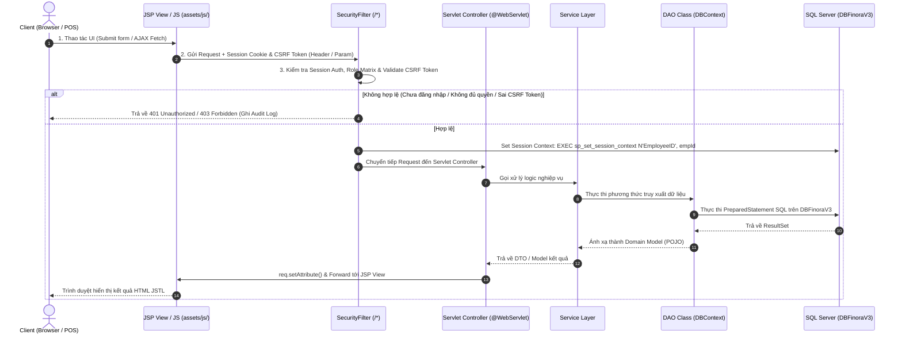

<div align="center">

# 🛒 FinoraRetail (SWP391_Finora)

### *Hệ Thống Quản Lý Bán Lẻ & Chuỗi Cửa Hàng Đa Chi Nhánh Thế Hệ Mới*

[](https://www.oracle.com/java/)
[](https://jakarta.ee/)
[](https://tomcat.apache.org/)
[](https://www.microsoft.com/sql-server)
[](https://maven.apache.org/)
[](#-kiến-trúc-bảo-mật--rbac)

---

[🚀 Hướng Dẫn Vận Hành](#-hướng-dẫn-cài-đặt--vận-hành-chi-tiết) • [✨ Tính Năng Nổi Bật](#-tính-năng-nổi-bật) • [🔄 Luồng Hoạt Động (JSP-JS-Java-DB)](#-luồng-hoạt-động-chi-tiết-jsp--js--java--db) • [🔒 Bảo Mật & RBAC](#-kiến-trúc-bảo-mật--rbac) • [📚 Tài Liệu Dự Án](#-bộ-tài-liệu-dự-án-docs)

</div>

---

## 📖 Giới Thiệu Dự Án

> [!NOTE]
> **FinoraRetail** (`SWP391_Finora`) là hệ thống phần mềm quản trị doanh nghiệp bán lẻ & chuỗi cửa hàng (ERP / POS / WMS) đa chi nhánh. Ứng dụng xử lý khép kín toàn bộ nghiệp vụ từ bán hàng tại quầy POS, thanh toán QR VNPay, quản lý kho bãi & điều chuyển hàng hóa, đến báo cáo doanh thu tài chính và nhật ký hoạt động audit log.

Ứng dụng được xây dựng theo kiến trúc phân lớp chuẩn mực **MVC + DAO + Service Layer**, chạy trên môi trường **Java 17** và **Jakarta Servlet 6.0 (Tomcat 10.1+)**, kết nối cơ sở dữ liệu **Microsoft SQL Server (`DBFinoraV3`)**.

---

## ✨ Tính Năng Nổi Bật

### 🏬 1. Quản Lý Đa Chi Nhánh & Kho Bãi (WMS)
* **Điều chuyển tồn kho (Stock Transfer):** Quản lý toàn bộ luồng đề xuất, phê duyệt và xác nhận phiếu chuyển hàng giữa các kho chi nhánh.
* **Kiểm kê định kỳ (Stocktaking):** Cân bằng kho, tự động tính toán đối soát chênh lệch giữa số lượng kiểm kê thực tế và số lượng trên sổ sách.
* **Phân quyền kho (Receipt Isolation):** Đảm bảo nhân viên kho chỉ truy cập và thao tác trên dữ liệu phiếu nhập/xuất kho thuộc chi nhánh được phân công.

### 💳 2. Bán Hàng POS & Thanh Toán Điện Tử VNPay
* **Màn hình POS tối ưu:** Tìm kiếm sản phẩm siêu tốc, quản lý giỏ hàng realtime, áp dụng mã voucher giảm giá.
* **Cổng thanh toán VNPay:** Tích hợp mã QR VNPay, checksum bảo mật HMAC-SHA512, tự động xử lý các luồng IPN callback và Return URL.
* **In hóa đơn & Điểm thưởng:** Tự động tính thuế VAT, cộng điểm thưởng tích lũy cho khách hàng thân thiết (`LoyaltyPointSetting`).

### 📊 3. Báo Cáo Doanh Thu & Thống Kê Tài Chính
* **Thống kê kinh doanh đa chiều:** Biểu đồ KPI doanh thu, chi phí, lợi nhuận theo từng ca làm việc (Shift) và từng chi nhánh.
* **Xuất báo cáo đa định dạng:** Xuất dữ liệu báo cáo Excel chuẩn với **Apache POI 5.2.5** và tệp PDF chuyên nghiệp với **OpenPDF 1.3.39**.
* **Nhật ký thu chi:** Quản lý chi tiết phiếu thu, phiếu chi, hóa đơn thanh toán và các giao dịch tiền mặt.

### 🛡 4. Phân Quyền Vận Hành & Audit Logging
* **Ma trận phân quyền (RBAC):** Phân định 5 nhóm vai trò chi tiết: `owner`, `admin`, `storemanager`, `warehousestaff`, `salesstaff`.
* **Bảo mật đa lớp:** Mã hóa mật khẩu BCrypt, chống tấn công CSRF token, tự động gắn Security Headers chống XSS & Framing.
* **Nhật ký hoạt động (Activity Log):** Ghi vết tự động mọi thao tác hệ thống và cảnh báo truy cập trái phép qua `sp_set_session_context`.

---

## 🔄 Luồng Hoạt Động Chi Tiết (JSP ➔ JS ➔ Java ➔ DB)

Mọi yêu cầu từ trình duyệt được xử lý khép kín qua các tầng kiến trúc:



---

## 🛠 Thư Viện & Công Nghệ Sử Dụng

| Phân loại | Công nghệ / Thư viện | Phiên bản | Vai trò & Chức năng |
|---|---|---|---|
| **Core Platform** | Java SE (JDK) | 17 | Ngôn ngữ lập trình chính |
| **Web Standard** | Jakarta Servlet API | 6.0.0 (EE 10) | Định tuyến Http Servlets & Filters |
| **View Engine** | JSP & JSTL (GlassFish) | 3.0.0 / 3.0.1 | Hiển thị giao diện render phía server |
| **Web Server** | Apache Tomcat | 10.1+ | Servlet Container |
| **Database** | Microsoft SQL Server | 2019 / 2022 | Cơ sở dữ liệu chính (`DBFinoraV3`) |
| **JDBC Driver** | `mssql-jdbc` | 12.6.1.jre11 | Kết nối Java với SQL Server |
| **Security** | `jbcrypt` | 0.4 | Mã hóa & kiểm tra mật khẩu BCrypt |
| **Excel Export** | Apache POI | 5.2.5 | Đọc/ghi báo cáo tệp Excel `.xlsx` |
| **PDF Export** | OpenPDF | 1.3.39 | Xuất hóa đơn & báo cáo dạng PDF |
| **Email SMTP** | Jakarta Mail | 2.0.1 | Gửi email thông báo & khôi phục mật khẩu |
| **Build Tool** | Apache Maven | 3.x | Quản lý phụ thuộc & đóng gói file WAR |

---

## 📁 Tổ Chức Thu Mục Mã Nguồn (`src/main/java/`)

```text
src/main/java/
├── constant/          # Hằng số toàn ứng dụng (AppConstants.java)
├── controller/        # 30+ Servlets xử lý HTTP Requests (phân theo domain)
│   ├── auth/          # AuthServlet.java (/login, /logout, /forgot-password)
│   ├── branch/        # BranchController.java
│   ├── customer/      # CustomerController.java
│   ├── dashboard/     # DashboardController.java
│   ├── finance/       # IncomeExpenseController, PaymentInvoiceController
│   ├── inventory/     # StockController, TransferController, InventoryCheckController...
│   ├── pos/           # PosController, CartServlet, CheckoutServlet
│   ├── product/       # ProductController, CategoryServlet
│   ├── sales/         # SalesServlet, RevenueServlet, ShiftServlet
│   ├── system/        # ActivityLogController, SystemController
│   ├── user/          # AdminUserServlet, OwnerUserServlet, ManagerEmployeeServlet...
│   └── vnpay/         # VNPayServlet, VNPayResultServlet, VNPayReturnServlet
├── dao/               # Data Access Objects (truy vấn DBFinoraV3, kế thừa DBContext)
├── dto/               # Data Transfer Objects (inventory DTOs, report filters)
├── filter/            # SecurityFilter.java (Bộ lọc bảo mật central /*)
├── model/             # 51 Domain POJO Entities (Product, Order, Employee, Inventory...)
├── service/           # Tầng nghiệp vụ trung gian (customer, inventory, finance, system...)
└── util/              # Tiện ích hệ thống (DBContext, PasswordUtil, ExcelImportUtil, MoneyUtil...)
```

---

## 🔒 Kiến Trúc Bảo Mật & RBAC

Bảo mật ứng dụng được quản lý tập trung qua **`filter.SecurityFilter`** (`urlPatterns = {"/*"}`):

### 1. Phân Quyền Role Matrix (`ROLE_MAP`)

| Đường dẫn URL Pattern | Vai trò có quyền truy cập |
|---|---|
| `/system/*`, `/admin/*`, `/configuration/*`, `/activity/*` | `admin`, `owner` |
| `/management/*`, `/manager/*`, `/branch` | `admin`, `owner`, `storemanager` |
| `/inventory/*`, `/warehouse/*`, `/product/*`, `/products`, `/supplier`, `/purchase/*` | `admin`, `owner`, `storemanager`, `warehousestaff` |
| `/pos/*`, `/customer/*`, `/sales/*`, `/cart/*`, `/checkout/*`, `/orders/*`, `/shift/*` | `admin`, `owner`, `storemanager`, `salesstaff` |
| `/owner/*` | `admin`, `owner`, `storemanager`, `salesstaff`, `warehousestaff` |

### 2. Tiêu Chuẩn Bảo Mật Bắt Buộc
* **Xác thực CSRF Token:** Mọi form gửi qua phương thức `POST` đều phải chứa `csrfToken` hoặc header `X-CSRF-Token` hợp lệ.
* **Mã hóa BCrypt:** Mật khẩu người dùng được băm an toàn với salt ngẫu nhiên qua `PasswordUtil.java`.
* **Security Headers:** Đặt tự động `Cache-Control: no-cache, no-store`, `X-Frame-Options: DENY`, `X-Content-Type-Options: nosniff`, `Referrer-Policy: same-origin`.
* **Audit Session Context:** Tự động gọi `DBContext.setCurrentEmployeeId(empId)` để thiết lập `sp_set_session_context` ghi log DB Triggers.

---

## 🚀 Hướng Dẫn Cài Đặt & Vận Hành Chi Tiết

### 📋 1. Yêu Cầu Môi Trường
* **Java Development Kit (JDK):** Version 17+ (đặt biến môi trường `JAVA_HOME`)
* **Build Tool:** Apache Maven 3.8+ (`mvn -v`)
* **Application Server:** Apache Tomcat 10.1+ (Hỗ trợ Jakarta EE 10 / Servlet 6.0)
* **Database Server:** Microsoft SQL Server 2019 / 2022

---

### 2. Khởi Tạo Cơ Sở Dữ Liệu SQL Server (`DBFinoraV3`)

1. Mở **SQL Server Management Studio (SSMS)** hoặc **Azure Data Studio**.
2. Kết nối tới SQL Server instance của bạn (mặc định `localhost:1433` hoặc remote IP).
3. Mở file script SQL chuẩn tại đường dẫn:
   ```file
   docs/3_DATABASE/Finora.sql
   ```
4. Thực thi toàn bộ script SQL (Script sẽ tự động chạy `CREATE DATABASE [DBFinoraV3]`, tạo 21 bảng, bổ sung stored procedures, triggers audit log và chèn dữ liệu mẫu).
5. Kiểm tra file kết nối CSDL tại [src/main/java/util/database/DBContext.java](file:///d:/Thangdev/SWP/SWP391_Finora-thang/src/main/java/util/database/DBContext.java):
   * Kết nối cơ sở dữ liệu: `databaseName=DBFinoraV3`
   * Có thể cấu hình thông qua biến môi trường hệ thống:
     * `DB_URL` (ví dụ: `jdbc:sqlserver://localhost:1433;databaseName=DBFinoraV3;encrypt=false;trustServerCertificate=true;`)
     * `DB_USER` (mặc định: `sa`)
     * `DB_PASSWORD` (mặc định: `a12345A@`)
6. **Kiểm tra kết nối CSDL:** Chạy kiểm thử kết nối bằng lệnh:
   ```powershell
   mvn exec:java -Dexec.mainClass="util.database.DBContext"
   ```
   Nếu màn hình báo `Connection to SQL Server successful.` là kết nối thành công!

---

### 3. Biên Dịch & Đóng Gói Dự Án (Maven)

Mở Terminal / PowerShell tại thư mục gốc dự án:

```powershell
# Clean và build đóng gói file WAR
mvn clean package -DskipTests
```

Sau khi quá trình build hoàn tất (`BUILD SUCCESS`), tệp WAR đã đóng gói sẽ nằm tại:
`target/StoreManagementNetBeans.war`

---

### 4. Triển Khai Lên Web Server (Apache Tomcat 10.1+)

<details>
<summary><b>🔹 Cách 1: Sử dụng NetBeans IDE (Khuyên dùng)</b></summary>

1. Mở NetBeans IDE 17+.
2. Chọn `File` ➔ `Open Project` ➔ Chọn thư mục dự án `SWP391_Finora-thang`.
3. Vào tab `Services` ➔ `Servers` ➔ Thêm **Apache Tomcat 10.1+**.
4. Nhấn phím `F6` (hoặc click phải dự án ➔ `Run`). NetBeans sẽ tự động build và deploy lên Tomcat với context path `/StoreManagementNetBeans` hoặc `/FinoraRetail`.
</details>

<details>
<summary><b>🔹 Cách 2: Sử dụng IntelliJ IDEA Ultimate</b></summary>

1. Mở dự án trong IntelliJ IDEA.
2. Click `Run` ➔ `Edit Configurations...` ➔ Click `+` ➔ Chọn `Tomcat Server` ➔ `Local`.
3. Trong tab `Server`: Chọn Tomcat 10.1 Server.
4. Trong tab `Deployment`: Click `+` ➔ Chọn `Artifact...` ➔ Chọn `StoreManagementNetBeans:war exploded`.
5. Đặt `Application context` thành `/FinoraRetail`.
6. Nhấn `Run` (Shift + F10).
</details>

<details>
<summary><b>🔹 Cách 3: Sử dụng VS Code + SmartTomcat Extension</b></summary>

1. Cài đặt Extension **SmartTomcat** trong VS Code.
2. Click biểu tượng SmartTomcat bên thanh sidebar ➔ Select Tomcat Directory (Tomcat 10.1).
3. Set `Set Config Directory`: `src/main/webapp`.
4. Set `Context Path`: `/FinoraRetail`.
5. Click `Run`.
</details>

<details>
<summary><b>🔹 Cách 4: Triển Khai Thủ Công Lên Tomcat Độc Lập (Manual Deploy)</b></summary>

1. Copy file `target/StoreManagementNetBeans.war` vào thư mục `webapps/` của Tomcat:
   ```powershell
   Copy-Item target/StoreManagementNetBeans.war -Destination "C:\Tomcat 10.1\webapps\FinoraRetail.war"
   ```
2. Khởi động Tomcat bằng cách chạy lệnh:
   ```powershell
   C:\Tomcat 10.1\bin\startup.bat
   ```
3. Tomcat sẽ tự giải nén file WAR và chạy ứng dụng.
</details>

---

### 5. Truy Cập & Kiểm Thử Ứng Dụng

Mở trình duyệt web và truy cập địa chỉ:
```text
http://localhost:8080/FinoraRetail/login
```
*(Hoặc `http://localhost:8080/StoreManagementNetBeans/login` tùy thuộc vào Context Path đã cấu hình)*

#### 🔑 Các Tài Khoản Mẫu Cho Từng Vai Trò (trong `Finora.sql`):
* **Owner / Admin (Chủ hệ thống / Quản trị):**
  - Path truy cập: `/dashboard/owner`, `/system/*`, `/finance/*`
* **Store Manager (Quản lý cửa hàng):**
  - Path truy cập: `/dashboard/`, `/management/*`, `/sales/*`, `/branch`
* **Warehouse Staff (Nhân viên kho):**
  - Path truy cập: `/inventory/*`, `/warehouse/*`, `/supplier`, `/purchase/*`
* **Sales Staff (Nhân viên bán hàng):**
  - Path truy cập: `/pos/*`, `/sales/*`, `/customer/*`, `/cart/*`, `/checkout/*`

---

## 📚 Bộ Tài Liệu Dự Án (`docs/`)

Toàn bộ tài liệu chi tiết của dự án được duy trì đồng bộ 100% với mã nguồn:

| Thư mục tài liệu | Mô tả nội dung |
|---|---|
| 📜 **[AGENTS.md](file:///d:/Thangdev/SWP/SWP391_Finora-thang/AGENTS.md)** | **Hợp đồng quy tắc làm việc bắt buộc cho AI Agent & Lập trình viên** |
| 📑 **[docs/README.md](file:///d:/Thangdev/SWP/SWP391_Finora-thang/docs/README.md)** | Chỉ mục tổng quan bộ tài liệu |
| 🌐 **`docs/1_OVERVIEW/`** | System Overview & Technology Stack chi tiết |
| 🏛 **`docs/2_ARCHITECTURE/`** | Sơ đồ kiến trúc MVC, FOLDER_STRUCTURE & DEPENDENCY_RULES |
| 💾 **`docs/3_DATABASE/`** | Database Schema Overview (`DBFinoraV3`), Table Details & Script SQL `Finora.sql` |
| 📦 **`docs/4_MODULES/`** | Tài liệu chi tiết 13 module chức năng hệ thống |
| 📈 **`docs/5_IMPLEMENTATION/`** | Trạng thái triển khai thực tế & Implemented Features |
| ⚙️ **`docs/6_DEVELOPMENT/`** | Tiêu chuẩn viết code & AI Agent Workflow rules |

---

<div align="center">

**FinoraRetail — SWP391 Project**  
*Phát triển bởi Đội ngũ Finora Software Group*

</div>
