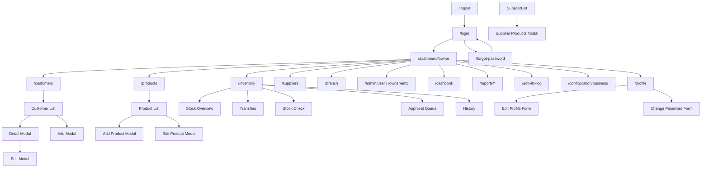
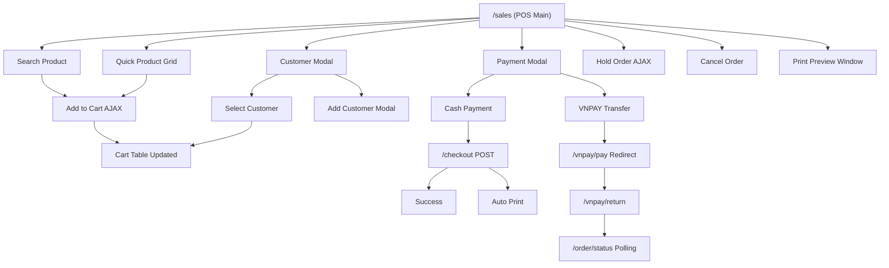
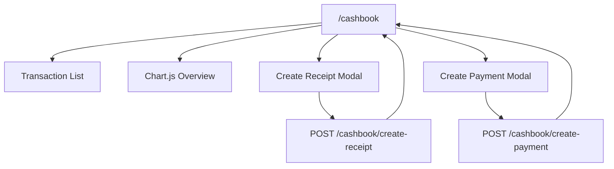
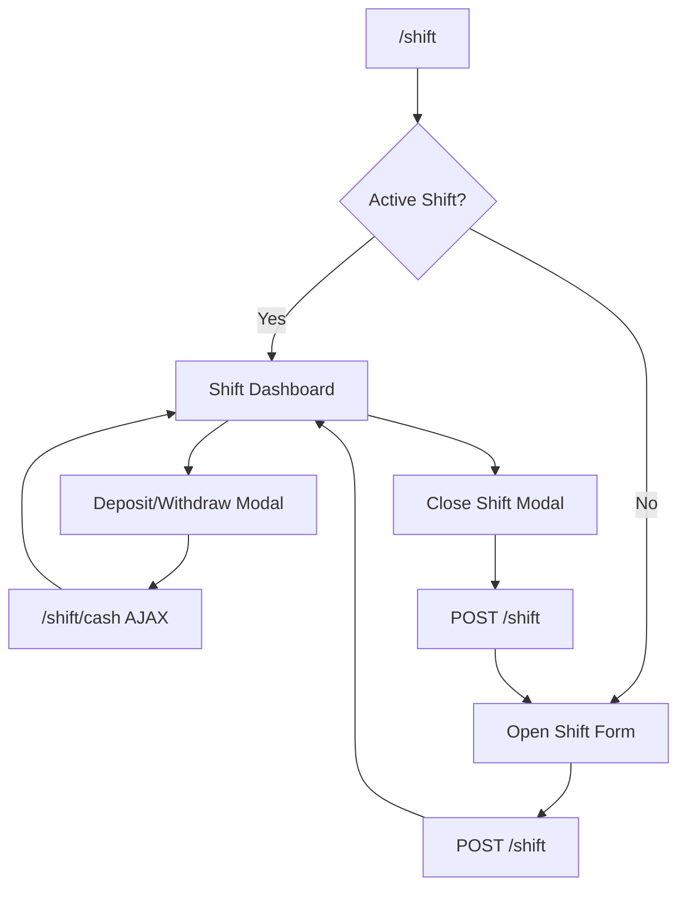
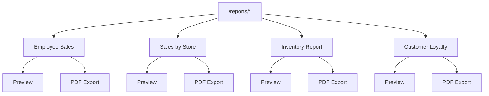
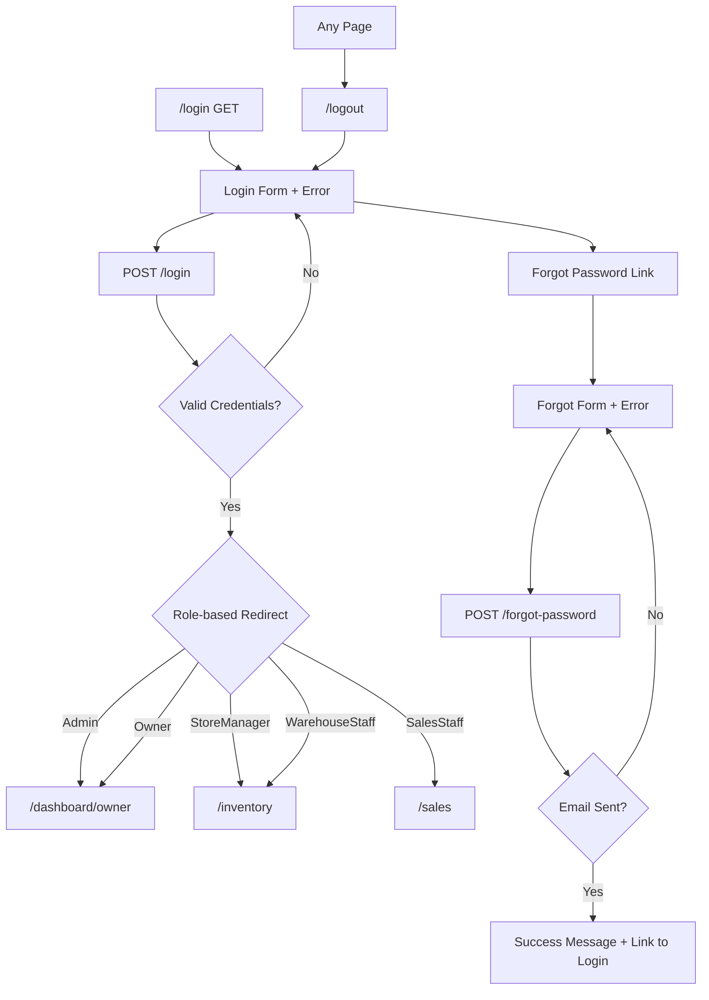

# Tài liệu Screen Flow - Hệ thống FinoraRetail

**Phiên bản:** 1.0  
**Ngày:** 14/07/2026  
**Dự án:** Finora - Hệ thống Quản trị Bán hàng (Store Management)

---

## Mục lục

1. [Tổng quan hệ thống](#1-tổng-quan-hệ-thống)
2. [Danh sách toàn bộ màn hình](#2-danh-sách-toàn-bộ-màn-hình)
3. [URL Mapping](#3-url-mapping)
4. [Vai trò (Role) và quyền truy cập](#4-vai-trò-role-và-quyền-truy-cập)
5. [Screen Flow dạng cây](#5-screen-flow-dạng-cây)
6. [Screen Flow dạng bảng](#6-screen-flow-dạng-bảng)
7. [Mermaid Flowchart](#7-mermaid-flowchart)
8. [PlantUML Flowchart](#8-plantuml-flowchart)
9. [Danh sách Popup/Modal và điều kiện hiển thị](#9-danh-sách-popupmodal-và-điều-kiện-hiển-thị)
10. [Màn hình chưa triển khai / Dead Route](#10-màn-hình-chưa-triển-khai--dead-route)

---

## 1. Tổng quan hệ thống

FinoraRetail là hệ thống quản trị bán hàng đa kênh hỗ trợ:
- **Vai trò**: Admin, Owner (Chủ cửa hàng), StoreManager (Quản lý chi nhánh), SalesStaff (Nhân viên bán hàng), WarehouseStaff (Nhân viên kho)
- **Kiến trúc**: Jakarta EE (Servlet + JSP + JDBC) trên MS SQL Server
- **Xác thực**: Session-based với BCrypt, CSRF token
- **Phân quyền**: SecurityFilter (`@WebFilter("/*")`)

---

## 2. Danh sách toàn bộ màn hình

Tổng số: **93 màn hình** (bao gồm modal, AJAX panel, placeholder)

### 2.1 Authentication (4 màn hình)

| # | Màn hình | URL | Loại |
|---|----------|-----|------|
| 1 | Login | `/login` | Form |
| 2 | Forgot Password | `/forgot-password` | Form |
| 3 | Role Selection | `/role-selection` | Redirect |
| 4 | Quick Login (Demo) | (trong login.jsp) | Component |

### 2.2 Dashboard (3 màn hình)

| # | Màn hình | URL | Loại |
|---|----------|-----|------|
| 5 | Owner Dashboard | `/dashboard/owner` | Trang tổng hợp |
| 6 | Inventory Dashboard | `/dashboard/inventory` | Trang tổng hợp |
| 7 | Financial Dashboard | `/dashboard/financial` | Trang tổng hợp |

### 2.3 Customer Management (5 màn hình)

| # | Màn hình | URL | Loại |
|---|----------|-----|------|
| 8 | Customer List | `/customers` | Danh sách + lọc + phân trang |
| 9 | Customer Detail | `/customers?action=detail&id=` | Modal |
| 10 | Add Customer | `/customers?action=add` | Modal |
| 11 | Edit Customer | `/customers?action=edit&id=` | Modal |
| 12 | Delete Customer | (POST `/customers` action=delete) | Form |

### 2.4 Product Management (7 màn hình)

| # | Màn hình | URL | Loại |
|---|----------|-----|------|
| 13 | Product List | `/products` | Danh sách + lọc + phân trang |
| 14 | Add Product | (Modal trên `/products`) | Modal |
| 15 | Edit Product | (Modal trên `/products`) | Modal |
| 16 | Delete Product | (POST `/products`) | Form |
| 17 | Category List | `/category` | Danh sách + lọc |
| 18 | Add Category | (Modal trên `/category`) | Modal |
| 19 | Edit Category | (Modal trên `/category`) | Modal |
| 20 | Delete Category | `/category?action=delete&id=` | Link |

### 2.5 Inventory / Warehouse (18 màn hình)

| # | Màn hình | URL | Loại |
|---|----------|-----|------|
| 21 | Inventory Overview (Stock) | `/inventory?tab=stock` | Tab |
| 22 | Warehouse Stock Detail | `/inventory?tab=stock&warehouseId=` | Tab |
| 23 | Stock Transfers | `/inventory?tab=transfer` | Tab |
| 24 | Create Transfer | `/inventory?tab=createTransfer` | Tab |
| 25 | Stock Check | `/inventory?tab=check` | Tab |
| 26 | Create Stock Check | `/inventory?tab=createCheck` | Tab |
| 27 | Import Orders | `/inventory?tab=import` | Tab |
| 28 | Export Orders | `/inventory?tab=export` | Tab |
| 29 | Approval Queue | `/inventory?tab=approval` | Tab |
| 30 | Pending Vouchers | `/inventory?tab=pending_vouchers` | Tab |
| 31 | Inventory History | `/inventory?tab=history` | Tab |
| 32 | Approval Management | `/approval` | Trang riêng |
| 33 | Warehouse Dashboard | `/warehouse/dashboard` | Trang |
| 34 | Warehouse Import | `/warehouse/import` | Trang |
| 35 | Warehouse Export | `/warehouse/export` | Trang |
| 36 | Warehouse Stock | `/warehouse/stock` | Trang |
| 37 | Edit Warehouse | (Modal trên inventory) | Modal |
| 38 | Ticket Details / Receipt | (Modal, AJAX) | Modal |

### 2.6 Sales / POS (14 màn hình)

| # | Màn hình | URL | Loại |
|---|----------|-----|------|
| 39 | POS Main (Bán hàng) | `/sales` | Trang lớn (Tailwind) |
| 40 | POS Sale | `/pos/sale` | Forward |
| 41 | POS History | `/pos/history` | Forward |
| 42 | POS Shift | `/pos/shift` | Forward |
| 43 | Cart Management (AJAX) | `/cart` | JSON API |
| 44 | Checkout | `/checkout` | POST |
| 45 | Order History | `/orders` | Danh sách + Slide-out |
| 46 | Order Detail (panel) | `/orders/detail?id=` | JSON API |
| 47 | Refund | `/orders/refund` | POST |
| 48 | Revenue Dashboard | `/revenue` | Dashboard (KPI + Chart) |
| 49 | Shift Management | `/shift` | Ca làm việc |
| 50 | Cash Transaction | `/shift/cash` | JSON API |
| 51 | Print Preview | `/print/preview` | HTML + window.print() |
| 52 | Product Search API | `/product/search` | JSON API |

### 2.7 Cashbook / Finance (3 màn hình)

| # | Màn hình | URL | Loại |
|---|----------|-----|------|
| 53 | Cashbook (Sổ Quỹ) | `/cashbook` | Danh sách + Chart.js |
| 54 | Create Receipt | `/cashbook/create-receipt` | Modal + POST |
| 55 | Create Payment | `/cashbook/create-payment` | Modal + POST |

### 2.8 Supplier Management (5 màn hình)

| # | Màn hình | URL | Loại |
|---|----------|-----|------|
| 56 | Supplier List | `/suppliers` | Danh sách + lọc |
| 57 | Add Supplier | (Modal) | Modal |
| 58 | Edit Supplier | (Modal) | Modal |
| 59 | Delete Supplier | `/suppliers?action=delete` | Link |
| 60 | Supplier Products | (Modal AJAX) | Modal + AJAX |

### 2.9 Branch Management (5 màn hình)

| # | Màn hình | URL | Loại |
|---|----------|-----|------|
| 61 | Branch List | `/branch` | Danh sách + lọc + KPI |
| 62 | Branch Detail | `/branch?action=detail&id=` | Trang |
| 63 | Add Branch | `/branch?action=add` | Trang (branch-form.jsp) |
| 64 | Edit Branch | `/branch?action=edit&id=` | Trang (branch-form.jsp) |
| 65 | Delete Branch | `/branch?action=delete&id=` | Link (có confirm modal) |

### 2.10 Employee / User Management (7 màn hình)

| # | Màn hình | URL | Loại |
|---|----------|-----|------|
| 66 | Admin User List | `/admin/user` | Danh sách + lọc |
| 67 | Add Employee (Admin) | `/admin/user?action=add` | Modal |
| 68 | Edit Employee (Admin) | `/admin/user?action=edit&id=` | Modal |
| 69 | Reset Password (Admin) | `/admin/user?action=reset&id=` | Modal |
| 70 | Owner Employee List | `/owner/emp` | Danh sách + lọc |
| 71 | Manager Employee List | `/manager/emp` | Danh sách (read-only) |

### 2.11 Reports (13 màn hình)

| # | Màn hình | URL | Loại |
|---|----------|-----|------|
| 72 | Employee Sales Report | `/reports/employee-sales` | Báo cáo + lọc |
| 73 | Employee Sales Preview | `/reports/employee-sales-preview` | Preview |
| 74 | Employee Sales Export | `/reports/employee-sales-export` | PDF Export |
| 75 | Sales by Store Report | `/reports/sales-by-store` | Báo cáo + lọc |
| 76 | Sales by Store Preview | `/reports/sales-by-store-preview` | Preview |
| 77 | Sales by Store Export | `/reports/sales-by-store-export` | PDF Export |
| 78 | Inventory Report | `/reports/inventory` | Báo cáo + lọc |
| 79 | Inventory Preview | `/reports/inventory-preview` | Preview |
| 80 | Inventory Export | `/reports/inventory-export` | PDF Export |
| 81 | Customer Loyalty Report | `/reports/customer-loyal` | Báo cáo + lọc |
| 82 | Customer Loyalty Preview | `/reports/customer-loyal-preview` | Preview |
| 83 | Customer Loyalty Export | `/reports/customer-loyal-export` | PDF Export |
| 84 | Export Reports (general) | `/reports/export` | Placeholder |

### 2.12 Profile (3 màn hình)

| # | Màn hình | URL | Loại |
|---|----------|-----|------|
| 85 | View Profile | `/profile` (GET) | Trang |
| 86 | Edit Profile | `/profile` (POST action=updateProfile) | Form |
| 87 | Change Password | `/profile` (POST action=changePassword) | Form |

### 2.13 System (3 màn hình)

| # | Màn hình | URL | Loại |
|---|----------|-----|------|
| 88 | Activity Log | `/activity-log` | Danh sách + lọc |
| 89 | Business Configuration | `/configuration/business` | Form (điểm/VAT) |
| 90 | Notifications | `/notifications` | Trang |

### 2.14 VNPay (4 màn hình)

| # | Màn hình | URL | Loại |
|---|----------|-----|------|
| 91 | VNPay Payment | `/vnpay/pay` | Redirect |
| 92 | VNPay Return | `/vnpay/return` | Callback GET |
| 93 | VNPay IPN | `/vnpay/ipn` | Server-to-server |
| 94 | VNPay Result | `/views/common/vnpay_result.jsp` | Forward |

### 2.15 Static Pages (3 màn hình)

| # | Màn hình | URL | Loại |
|---|----------|-----|------|
| 95 | About | `/about` | Placeholder |
| 96 | Contact | `/contact` | Placeholder |
| 97 | SEO | `/seo` | Placeholder |

---

## 3. URL Mapping

### 3.1 SecurityFilter (Filter)

```
@WebFilter("/*")
PUBLIC_PATHS = {"/login", "/logout", "/forgot-password", "/register", "/role-selection", "/assets/", "/css/", "/js/", "/static/", "/vnpay/ipn", "/vnpay/return", "/order/status"}
```

### 3.2 Danh sách Servlet

| Servlet | URL Patterns | Base Controller |
|---------|--------------|-----------------|
| AuthServlet | `/login`, `/logout`, `/forgot-password`, `/role-selection` | HttpServlet |
| DashboardController | `/dashboard/owner`, `/dashboard/inventory`, `/dashboard/financial` | BaseController |
| CustomerController | `/customers` | HttpServlet |
| BranchController | `/branch` | HttpServlet (Multipart) |
| ProductController | `/products` | BaseController (Multipart) |
| CategoryController | `/category` | BaseController |
| InventoryController | `/inventory` | BaseController |
| ApprovalController | `/approval` | HttpServlet |
| IncomeExpenseController | `/cashbook`, `/cashbook/create-receipt`, `/cashbook/create-payment` | BaseController |
| PaymentInvoiceController | `/payments`, `/invoices` | BaseController |
| SupplierServlet | `/suppliers` | HttpServlet |
| PurchaseOrderController | `/purchase-orders`, `/purchase-orders/detail` | BaseController |
| SalesServlet | `/sales` | HttpServlet |
| CartServlet | `/cart` | HttpServlet |
| CheckoutServlet | `/checkout` | HttpServlet |
| OrdersServlet | `/orders`, `/orders/detail`, `/orders/refund` | HttpServlet |
| OrderStatusServlet | `/order/status` | HttpServlet |
| ProductSearchServlet | `/product/search` | HttpServlet |
| PrintPreviewServlet | `/print/preview` | HttpServlet |
| ShiftServlet | `/shift` | HttpServlet |
| CashTransactionServlet | `/shift/cash` | HttpServlet |
| PosController | `/pos/sale`, `/pos/history`, `/pos/shift` | BaseController |
| RevenueServlet | `/revenue` | HttpServlet |
| ReportsServlet | `/reports` | HttpServlet |
| SettingsServlet | `/settings` | HttpServlet |
| ReportController | `/reports/employee-sales`, `/reports/employee-sales-preview`, `/reports/employee-sales-export`, `/reports/sales-by-store`, `/reports/sales-by-store-preview`, `/reports/sales-by-store-export`, `/reports/inventory`, `/reports/inventory-preview`, `/reports/inventory-export`, `/reports/customer-loyal`, `/reports/customer-loyal-preview`, `/reports/customer-loyal-export`, `/reports/export` | BaseController |
| ProfileServlet | `/profile` | HttpServlet (Multipart) |
| AdminUserServlet | `/admin/user` | HttpServlet |
| OwnerUserServlet | `/owner/emp` | HttpServlet |
| ManagerEmployeeServlet | `/manager/emp` | HttpServlet |
| ActivityLogController | `/activity-log` | BaseController |
| SystemController | `/notifications`, `/configuration/business` | BaseController |
| VNPayServlet | `/vnpay/pay` | HttpServlet |
| VNPayReturnServlet | `/vnpay/return` | HttpServlet |
| VNPayIPNServlet | `/vnpay/ipn` | HttpServlet |
| WarehouseController | `/warehouse/dashboard`, `/warehouse/import`, `/warehouse/export`, `/warehouse/stock` | BaseController |
| StaticPageController | `/about`, `/contact`, `/seo` | BaseController |

---

## 4. Vai trò (Role) và quyền truy cập

### 4.1 Ma trận quyền

| Màn hình | Admin | Owner | StoreManager | SalesStaff | WarehouseStaff |
|----------|:-----:|:-----:|:------------:|:----------:|:--------------:|
| **Login** | ✓ | ✓ | ✓ | ✓ | ✓ |
| **Forgot Password** | ✓ | ✓ | ✓ | ✓ | ✓ |
| **Owner Dashboard** | ✓ | ✓ | ✓ | ✗ | ✗ |
| **Inventory Dashboard** | ✗ | ✓ | ✓ | ✗ | ✓ |
| **Financial Dashboard** | ✓ | ✓ | ✗ | ✗ | ✗ |
| **Customer List** | ✗ | ✓ | ✓ | ✗ | ✗ |
| **Customer Detail** | ✗ | ✓ | ✓ | ✗ | ✗ |
| **Add/Edit Customer** | ✗ | ✓ | ✓ | ✗ | ✗ |
| **Product List** | ✓ | ✓ | ✓ | ✗ | ✓ |
| **Add/Edit Product** | ✓ | ✓ | ✓ | ✗ | ✓ |
| **Category List** | ✓ | ✓ | ✓ | ✗ | ✗ |
| **Add/Edit Category** | ✓ | ✓ | ✓ | ✗ | ✗ |
| **Inventory (Stock)** | ✓ | ✓ | ✓ | ✗ | ✓ |
| **Inventory Transfers** | ✗ | ✓ | ✓ | ✗ | ✓ |
| **Stock Check** | ✗ | ✓ | ✓ | ✗ | ✓ |
| **Import/Export Orders** | ✗ | ✓ | ✓ | ✗ | ✗ |
| **Approval Queue** | ✓ | ✓ | ✓ | ✗ | ✗ |
| **Pending Vouchers** | ✗ | ✗ | ✗ | ✗ | ✓ |
| **POS / Sales** | ✓ | ✓ | ✓ | ✓ | ✗ |
| **Cart / Checkout** | ✓ | ✓ | ✓ | ✓ | ✗ |
| **Order History** | ✓ | ✓ | ✓ | ✓ | ✗ |
| **Revenue Dashboard** | ✓ | ✓ | ✓ | ✗ | ✗ |
| **Shift Management** | ✓ | ✓ | ✓ | ✓ | ✗ |
| **Cashbook** | ✓ | ✓ | ✓ | ✗ | ✗ |
| **Suppliers** | ✓ | ✓ | ✓ | ✗ | ✗ |
| **Branch Management** | ✓ | ✓ | ✗ | ✗ | ✗ |
| **Admin User Management** | ✓ | ✗ | ✗ | ✗ | ✗ |
| **Owner Employee Mgmt** | ✗ | ✓ | ✗ | ✗ | ✗ |
| **Manager Employee List** | ✗ | ✗ | ✓ | ✗ | ✗ |
| **Reports** | ✓ | ✓ | ✓ | ✗ | ✗ |
| **Profile** | ✓ | ✓ | ✓ | ✓ | ✓ |
| **Activity Log** | ✓ | ✓ | ✗ | ✗ | ✗ |
| **Business Config** | ✓ | ✓ | ✗ | ✗ | ✗ |
| **VNPay** | ✓ | ✓ | ✓ | ✓ | ✗ |
| **Warehouse Ops** | ✗ | ✓ | ✓ | ✗ | ✓ |
| **Static Pages** | ✓ | ✓ | ✓ | ✓ | ✓ |

### 4.2 Luồng redirect sau login

| Role | Redirect URL |
|------|-------------|
| Admin | `/dashboard/owner` |
| Owner | `/dashboard/owner` |
| StoreManager | `/inventory` |
| WarehouseStaff | `/inventory` |
| SalesStaff | `/sales` |

---

## 5. Screen Flow dạng cây

```
LOGIN (/login)
├── Forgot Password (/forgot-password) → Back to Login
└── DASHBOARD (/dashboard/owner)
     │
     ├── Customer Management (/customers)
     │    ├── Customer List
     │    ├── [Modal] Add Customer
     │    ├── [Modal] Edit Customer
     │    ├── [Modal] Customer Detail
     │    │    ├── Point History
     │    │    ├── Order History
     │    │    ├── Sync Loyalty (POST)
     │    │    └── Redeem Points (POST)
     │    └── Delete Customer (POST)
     │
     ├── Inventory Management (/inventory)
     │    ├── Stock Overview (tab=stock)
     │    │    ├── Warehouse Cards
     │    │    └── Warehouse Detail → Stock Table
     │    ├── [Modal] Create Import Order
     │    ├── [Modal] Create Export Order
     │    ├── [Modal] Receipt Form (AJAX)
     │    ├── [Modal] Ticket Details (AJAX)
     │    ├── [Modal] Reject Dispatch
     │    ├── Transfer List (tab=transfer)
     │    │    └── Create Transfer (tab=createTransfer)
     │    ├── Stock Check (tab=check)
     │    │    └── Create Check (tab=createCheck)
     │    ├── Approval Queue (tab=approval)
     │    ├── Pending Vouchers (tab=pending_vouchers)
     │    └── History (tab=history)
     │
     ├── Product Management (/products)
     │    ├── Product List
     │    ├── [Modal] Add Product
     │    ├── [Modal] Edit Product
     │    └── Delete Product (POST)
     │
     ├── Category Management (/category)
     │    ├── Category List
     │    ├── [Modal] Add Category
     │    ├── [Modal] Edit Category
     │    └── Delete Category (Link)
     │
     ├── Supplier Management (/suppliers)
     │    ├── Supplier List
     │    ├── [Modal] Add Supplier
     │    ├── [Modal] Edit Supplier
     │    ├── Delete Supplier (Link)
     │    └── [Modal] Supplier Products (AJAX)
     │         ├── Add Product to Supplier
     │         ├── Update Price (AJAX)
     │         └── Delete Product from Supplier
     │
     ├── Branch Management (/branch) [Admin, Owner]
     │    ├── Branch List
     │    ├── Branch Detail
     │    ├── Add Branch (branch-form.jsp)
     │    ├── Edit Branch (branch-form.jsp)
     │    └── Delete Branch (confirm phrase modal)
     │
     ├── Employee Management
     │    ├── Admin: /admin/user [Admin]
     │    │    ├── Employee List
     │    │    ├── [Modal] Add Employee
     │    │    ├── [Modal] Edit Employee
     │    │    ├── [Modal] Detail Employee
     │    │    ├── [Modal] Reset Password
     │    │    ├── Lock/Unlock (POST)
     │    │    └── View Profile → /profile?id=
     │    ├── Owner: /owner/emp [Owner]
     │    │    └── (similar to admin but multi-branch)
     │    └── Manager: /manager/emp [StoreManager]
     │         └── Read-only list (branch-scoped)
     │
     ├── Cashbook (/cashbook) [Admin, Owner, StoreManager]
     │    ├── Transaction List + Chart
     │    ├── [Modal] Create Receipt (POST)
     │    └── [Modal] Create Payment (POST)
     │
     ├── Reports (/reports/*)
     │    ├── Employee Sales Report
     │    │    ├── Preview
     │    │    └── Export PDF
     │    ├── Sales by Store Report
     │    │    ├── Preview
     │    │    └── Export PDF
     │    ├── Inventory Report
     │    │    ├── Preview
     │    │    └── Export PDF
     │    ├── Customer Loyalty Report
     │    │    ├── Preview
     │    │    └── Export PDF
     │    └── Export (placeholder)
     │
     ├── POS / Sales Flow
     │    ├── POS Main (/sales)
     │    │    ├── Product Search (barcode + text)
     │    │    ├── Quick Product Grid
     │    │    ├── Multi-tab Cart (AJAX)
     │    │    ├── Customer Select (Modal)
     │    │    │    ├── Walk-in Customer
     │    │    │    ├── Select Existing (AJAX search)
     │    │    │    └── Add New Customer (Modal)
     │    │    ├── Edit Customer (Modal)
     
     │    │    ├── Hold Order
     │    │    ├── Print Preview
     │    │    ├── Cancel Order
     │    │    └── Payment Modal
     │    │         ├── Cash Payment
     │    │         │    ├── Amount Input
     │    │         │    ├── Quick Cash Suggestions
     │    │         │    └── Change Calculation
     │    │         ├── VNPAY Transfer
     │    │         │    ├── VNPAY Window
     │    │         │    ├── QR Status Polling
     │    │         │    ├── VNPay Return (/vnpay/return)
     │    │         │    └── VNPay IPN (/vnpay/ipn)
     │    │         └── Auto Print Toggle
     │    │
     │    ├── Order History (/orders)
     │    │    ├── Search + Filter
     │    │    ├── Order Table (paginated)
     │    │    └── Slide-out Detail Panel (AJAX)
     │    │         ├── Print Invoice
     │    │         └── Send Email
     │    │
     │    ├── Revenue Dashboard (/revenue)
     │    │    ├── Date Filter
     │    │    ├── Employee Filter
     │    │    ├── 5 KPI Cards
     │    │    ├── Hourly Bar Chart
     │    │    ├── Payment Method Donut Chart
     │    │    ├── Top Products List
     │    │    └── Recent Transactions
     │    │
     │    └── Shift Management (/shift)
     │         ├── [Active Shift] Shift Dashboard
     │         │    ├── Cash Ledger
     │         │    ├── Deposit/Withdraw (Modal) → AJAX
     │         │    └── Close Shift (Modal) → POST
     │         └── [No Shift] Open Shift Form
     │              └── Shift History Table
     │
     ├── Profile (/profile)
     │    ├── Profile Info
     │    ├── Sales Performance (if applicable)
     │    ├── Order History
     │    ├── Edit Profile (Form + Avatar Upload)
     │    └── Change Password (Form)
     │
     ├── Activity Log (/activity-log) [Admin, Owner]
     │    ├── Filter (keyword, entity, action, date range)
     │    ├── Log Table (paginated)
     │    └── [Modal] Log Detail
     │
     ├── Business Configuration (/configuration/business)
     │    ├── Point Earn Rate Setting
     │    ├── Point Redeem Rate Setting
     │    └── VAT Percentage Setting
     │
     └── Logout (/logout) → Redirect to Login
```

### POS-only Sidebar Flow (SalesStaff)

```
SALESSTAFF SIDEBAR
├── POS Main (/sales)
├── Order History (/orders)
├── Shift (/shift)
├── Cashbook (/cashbook) [nếu có quyền]
├── Product List (/products)
├── Categories (/category)
├── Branch (/branch) [nếu có quyền]
├── Employee (/admin/user or /owner/emp or /manager/emp)
├── Revenue (/revenue) [nếu có quyền]
└── Profile (/profile)
     └── Logout (/logout)
```

---

## 6. Screen Flow dạng bảng

### 6.1 Authentication Flow

| Từ | Hành động | Đến | Điều kiện |
|----|-----------|-----|-----------|
| Login | Submit (POST) | Dashboard | Đăng nhập thành công |
| Login | Submit (POST) | Login (with error) | Sai thông tin |
| Login | Click "Quên mật khẩu" | Forgot Password | — |
| Forgot Password | Submit (POST) | Forgot Password (success) | Gửi email thành công |
| Forgot Password | Click "Quay lại" | Login | — |
| Any page | Click Logout | Login | Session invalidated |

### 6.2 POS Sales Flow

| Từ | Hành động | Đến | Điều kiện |
|----|-----------|-----|-----------|
| POS Main | Search product | Add to cart | AJAX |
| POS Main | Click product grid | Add to cart | AJAX |
| POS Main | Click "Thay đổi" | Customer Modal | — |
| Customer Modal | Click customer | Select customer | AJAX |
| Customer Modal | Click "Thêm mới" | Add Customer Modal | — |
| POS Main | Click VNPAY | VNPAY Panel | Chọn BANK_TRANSFER |
| POS Main | Click "THANH TOÁN" | Payment Modal | — |
| Payment Modal | Click "Xác nhận" | Checkout (POST) | — |
| Checkout | Payment CASH | Success Toast | Order created |
| Checkout | Payment BANK_TRANSFER | VNPAY Window | Redirect to VNPay |
| VNPay Return | Callback | Order Status | Update order status |
| POS Main | Click "LƯU TẠM" | Hold cart | AJAX |
| POS Main | Click "HUỶ ĐƠN" | Clear cart | Confirm dialog |
| POS Main | Click "IN THỬ" | Print Preview | New window |

### 6.3 Inventory Flow

| Từ | Hành động | Đến | Điều kiện |
|----|-----------|-----|-----------|
| Inventory | Click warehouse | Warehouse Stock | Tab load |
| Stock | Click "Nhập Hàng" | Import Modal | — |
| Stock | Click "Xuất Excel" | Export Stock | — |
| Transfer | Click "Tạo mới" | Create Transfer | Tab load |
| Transfer | Approve/Reject | Update status | POST |
| Check | Click "Tạo phiếu kiểm" | Create Check | Tab load |
| Check | Click chi tiết | Check Detail Modal | AJAX |
| Approval | Click "Duyệt" | Approve | POST |
| Approval | Click "Từ chối" | Reject Modal | — |

### 6.4 Customer Management Flow

| Từ | Hành động | Đến | Điều kiện |
|----|-----------|-----|-----------|
| Customer List | Click "Xem" | Customer Detail Modal | action=detail |
| Customer Detail | Click "Chỉnh sửa" | Edit Customer | action=edit |
| Customer Detail | Click "Đồng bộ" | Sync Loyalty | POST |
| Customer Detail | Click "Đổi điểm" | Redeem Points | POST |
| Customer List | Click "Thêm mới" | Add Customer Modal | action=add |
| Customer List | Click "Xóa" | Delete | POST + confirm |

### 6.5 Employee Management Flow (Admin)

| Từ | Hành động | Đến | Điều kiện |
|----|-----------|-----|-----------|
| Admin User List | Click "Xem" | Detail Modal | action=detail |
| Admin User List | Click "Sửa" | Edit Modal | action=edit |
| Admin User List | Click "Key" | Reset Password Modal | action=reset |
| Admin User List | Click Lock/Unlock | POST | action=lock/unlock |
| Admin User List | Click "Thêm" | Add Modal | action=add |

---

## 7. Mermaid Flowchart

### 7.1 Overall System Flow



### 7.2 POS Flow



### 7.3 Cashbook Flow



### 7.4 Shift Management Flow



### 7.5 Reports Flow



### 7.6 Authentication Flow



---

## 8. PlantUML Flowchart

```plantuml
@startuml FinoraScreenFlow
skinparam backgroundColor #F8F9FA
skinparam shadowing false

title FinoraRetail - Screen Flow Diagram

state Login as "/login"
state ForgotPassword as "/forgot-password"
state Dashboard as "/dashboard/owner"
state CustomerList as "/customers"
state CustomerDetail as "Customer Detail [Modal]"
state AddCustomer as "Add Customer [Modal]"
state EditCustomer as "Edit Customer [Modal]"
state ProductList as "/products"
state ProductAddEdit as "Product Add/Edit [Modal]"
state CategoryList as "/category"
state CategoryAddEdit as "Category Add/Edit [Modal]"
state Inventory as "/inventory"
state StockTab as "Stock Overview [tab]"
state TransferTab as "Transfers [tab]"
state CheckTab as "Stock Check [tab]"
state ApprovalTab as "Approval [tab]"
state HistoryTab as "History [tab]"
state POS as "/sales (POS Main)"
state Cart as "/cart (AJAX)"
state Checkout as "/checkout"
state Orders as "/orders"
state OrderDetail as "Order Detail [Slide Panel]"
state Revenue as "/revenue"
state Shift as "/shift"
state Cashbook as "/cashbook"
state CreateReceipt as "Create Receipt [Modal]"
state CreatePayment as "Create Payment [Modal]"
state SupplierList as "/suppliers"
state SupplierProducts as "Supplier Products [Modal]"
state BranchList as "/branch"
state BranchForm as "Branch Add/Edit"
state UserList as "/admin/user"
state UserModal as "Employee Add/Edit/Reset [Modal]"
state OwnerEmpList as "/owner/emp"
state ManagerEmpList as "/manager/emp"
state Profile as "/profile"
state EditProfile as "Edit Profile Form"
state ChangePassword as "Change Password Form"
state ActivityLog as "/activity-log"
state BusinessConfig as "/configuration/business"
state VNPayPay as "/vnpay/pay"
state VNPayReturn as "/vnpay/return"
state VNPayIPN as "/vnpay/ipn"

Login --> Dashboard : Login success
Login --> Login : Login failed
Login --> ForgotPassword : Click "Quên mật khẩu"
ForgotPassword --> Login : Back

Dashboard --> CustomerList
Dashboard --> ProductList
Dashboard --> CategoryList
Dashboard --> Inventory
Dashboard --> SupplierList
Dashboard --> BranchList
Dashboard --> UserList : Admin role
Dashboard --> OwnerEmpList : Owner role
Dashboard --> ManagerEmpList : Manager role
Dashboard --> Cashbook
Dashboard --> Orders
Dashboard --> POS
Dashboard --> Revenue
Dashboard --> Profile
Dashboard --> ActivityLog
Dashboard --> BusinessConfig

CustomerList --> CustomerDetail : action=detail
CustomerList --> AddCustomer : action=add
CustomerDetail --> EditCustomer : action=edit
CustomerDetail --> CustomerList : Close

ProductList --> ProductAddEdit : Modal open
CategoryList --> CategoryAddEdit : Modal open

Inventory --> StockTab
Inventory --> TransferTab
Inventory --> CheckTab
Inventory --> ApprovalTab
Inventory --> HistoryTab
StockTab --> StockTab : Import/Export Modal

POS --> Cart : AJAX add/update
POS --> Checkout : Payment
Checkout --> VNPayPay : If BANK_TRANSFER
VNPayPay --> VNPayReturn : Callback
VNPayReturn --> Orders : Status update
POS --> Orders : Order complete
POS --> Shift : Shift link
Orders --> OrderDetail : AJAX click row

Shift --> Shift : Open/Close/DEPOSIT/WITHDRAW

Cashbook --> CreateReceipt : Lập phiếu thu
Cashbook --> CreatePayment : Lập phiếu chi

SupplierList --> SupplierProducts : Click "Sản phẩm"

UserList --> UserModal : action=add/edit/reset
UserList --> Profile : action=detail

Profile --> EditProfile : Update profile
Profile --> ChangePassword : Change password

Login --> Logout : Session end
Dashboard --> Logout : Via sidebar

@enduml
```



---

## 9. Danh sách Popup/Modal và điều kiện hiển thị

### 9.1 Modals

| Modal | Màn hình cha | Điều kiện hiển thị | Nội dung |
|-------|-------------|-------------------|----------|
| Customer Detail | Customer List | `?action=detail&id=` | Thông tin KH, điểm, lịch sử đơn hàng, đồng bộ điểm, đổi điểm |
| Add Customer | Customer List | `?action=add` | Form thêm KH (họ tên, SĐT, email, ngày sinh, giới tính, địa chỉ) |
| Edit Customer | Customer List | `?action=edit&id=` | Form sửa KH |
| Add Product | Product List | Modal toggle | Form thêm SP (tên, danh mục, đơn vị, giá, ảnh) |
| Edit Product | Product List | Modal toggle | Form sửa SP |
| Add Category | Category List | Modal toggle | Form thêm danh mục |
| Edit Category | Category List | Modal toggle, data attributes | Form sửa danh mục |
| Add/Edit Employee | User List | `?action=add` hoặc `?action=edit&id=` | Form thêm/sửa nhân viên (họ tên, email, SĐT, chi nhánh, vai trò) |
| Reset Password | User List | `?action=reset&id=` | Confirm + email mật khẩu mới |
| User Detail | User List | `?action=detail&id=` | Thông tin tài khoản |
| Delete Confirm | Branch List | Click delete button | Nhập "XAC NHAN" để xác nhận xóa |
| Payment | POS Main | Click "THANH TOÁN" | Chọn phương thức, nhập tiền, tính tiền thừa, in hóa đơn |
| Customer Select | POS Main | Click "Thay đổi" | Danh sách KH, tìm kiếm, thêm mới |
| Add Customer (POS) | POS Main | Click "Thêm mới" (customer modal) | Form thêm KH nhanh |
| Edit Customer (POS) | POS Main | Click "Sửa" (customer panel) | Form sửa KH nhanh |
| Deposit/Withdraw | Shift | Click "Rút/Nạp tiền" | Loại giao dịch, số tiền, ghi chú |
| Close Shift | Shift | Click "Kết thúc ca" | Nhập tiền mặt kiểm đếm |
| Create Receipt | Cashbook | Click "Lập phiếu thu" | Số tiền, hình thức thu, nội dung |
| Create Payment | Cashbook | Click "Lập phiếu chi" | Số tiền, hình thức chi, nội dung |
| Import Order | Inventory | Click "Nhập Hàng" | Form tạo phiếu nhập |
| Export Order | Inventory | Click "Xuất Hàng" | Form tạo phiếu xuất |
| Ticket Details | Inventory | Click "Xem chi tiết" | AJAX load chi tiết phiếu |
| Receipt Form | Inventory | Confirm receipt | AJAX form nhận hàng |
| Reject Dispatch | Inventory | Click "Từ chối" | Lý do từ chối |
| Edit Warehouse | Inventory | Modal toggle | Sửa tên/địa chỉ kho |
| Supplier Products | Supplier List | Click "Sản phẩm" | AJAX load, thêm/xóa/sửa giá |
| Activity Log Detail | Activity Log | Click "Xem nội dung" | Dữ liệu trước/sau |

### 9.2 Slide-out Panels

| Panel | Màn hình cha | Kích hoạt | Nội dung |
|-------|-------------|-----------|----------|
| Order Detail | Order History | Click row | Thông tin đơn hàng, sản phẩm, khách hàng, thanh toán |

### 9.3 AJAX Components

| Component | URL | Method | Trigger |
|-----------|-----|--------|---------|
| Cart Load | `/cart` | GET | DOMContentLoaded |
| Cart Add | `/cart` | POST | Click product |
| Cart Update | `/cart` | POST | Change quantity |
| Cart Remove | `/cart` | POST | Click remove |
| Cart New Tab | `/cart` | POST | Click "Thêm đơn mới" |
| Cart Switch Tab | `/cart` | POST | Click tab |
| Cart Hold | `/cart` | POST | Click "LƯU TẠM" |
| Cart Clear | `/cart` | POST | Click "HUỶ ĐƠN" |

| Cash Transaction | `/shift/cash` | POST | Submit deposit/withdraw |
| Order Detail | `/orders/detail?id=` | GET | Click order row |
| Product Search | `/product/search` | GET | Type in search (POS) |
| Order Status | `/order/status` | GET | Polling (VNPay) |
| Supplier Products | `/suppliers?action=get-products-api` | GET | Open supplier products modal |
| Active Products | `/suppliers?action=get-active-products-api` | GET | Load product dropdown |
| Add Supplier Product | `/suppliers?action=add-product-api` | GET | Add product to supplier |
| Update Price | `/suppliers?action=update-price-api` | GET | Change import price |
| Delete Supplier Product | `/suppliers?action=delete-product-api` | GET | Remove product from supplier |

---

## 10. Màn hình chưa triển khai / Dead Route

### 10.1 Placeholder Pages (JSP mẫu, không có logic thực tế)

| URL | File | Ghi chú |
|-----|------|---------|
| `/invoices` | `/views/invoices/list.jsp` | JSP mẫu, không có DAO/Service |
| `/payments` | `/views/payments/list.jsp` | Forward từ PaymentInvoiceController (BaseController forward) |
| `/purchase-orders` | `/views/purchase-orders/list.jsp` | JSP mẫu |
| `/purchase-orders/detail` | `/views/purchase-orders/detail.jsp` | JSP mẫu |
| `/reports` | `/views/sales/placeholder.jsp` | ReportsServlet forward → placeholder.jsp ("Chức năng đang phát triển") |
| `/settings` | `/views/sales/placeholder.jsp` | SettingsServlet forward → placeholder.jsp |
| `/reports/export` | `/views/reports/export.jsp` | JSP mẫu (không có logic thực tế) |
| `/income/list` | `/views/income/list.jsp` | JSP mẫu (không có servlet mapping?) |
| `/expenses/list` | `/views/expenses/list.jsp` | JSP mẫu (không có servlet mapping?) |
| `/orders/list` (old) | `/views/orders/list.jsp` | JSP cũ, đã có `/orders` mới |
| `/about` | `/views/about.jsp` | StaticPageController forward → JSP mẫu |
| `/contact` | `/views/contact.jsp` | StaticPageController forward → JSP mẫu |
| `/seo` | `/views/seo/index.jsp` | StaticPageController forward → JSP mẫu |
| `/pos/sale` | `/views/pos/sale.jsp` | PosController forward (chưa xác nhận có dữ liệu thực) |
| `/pos/history` | `/views/pos/history.jsp` | PosController forward |
| `/pos/shift` | `/views/pos/shift.jsp` | PosController forward |
| `/notifications` | (chưa có JSP rõ ràng) | SystemController |

### 10.2 Dead Routes (servlet mapping nhưng không dùng trong navigation)

| URL | Servlet | Ghi chú |
|-----|---------|---------|
| `/role-selection` | AuthServlet | Không có UI, chỉ redirect. Có thể là legacy từ multi-role account |
| `/dashboard/inventory` | DashboardController | Không có trong sidebar navigation |
| `/dashboard/financial` | DashboardController | Không có trong sidebar navigation |
| `/register` | (trong PUBLIC_PATHS) | SecurityFilter cho phép nhưng không có servlet xử lý |
| `/order-history` (old) | (trong OrdersServlet?) | Có cả `/orders` và `/views/sales/order-history.jsp` riêng |

### 10.3 Chức năng chưa hoàn thiện

| Chức năng | Mô tả |
|-----------|-------|
| **Purchase Orders** | `PurchaseOrderController` chỉ forward đến JSP mẫu, không có CRUD thực tế |
| **Invoice Management** | `/invoices` và `/payments` đều là placeholder |
| **Income/Expense standalone** | `income/list.jsp` và `expenses/list.jsp` không có servlet mapping |
| **Static Pages** | `/about`, `/contact`, `/seo` chỉ là JSP mẫu |
| **Bulk Export Reports** | `/reports/export` là placeholder |

### 10.4 Lưu ý kiến trúc

1. **POS có 2 giao diện**: `sales.jsp` (TailwindCSS mới) và `order-history.jsp` (CSS cũ) — đang chuyển đổi
2. **Cashbook** sử dụng `IncomeExpenseController` mapping `/cashbook` nhưng JSP nằm ở `/views/payments/list.jsp`
3. **Order history** có 2 JSP: `orders.jsp` (mới, slide-out panel) và `order-history.jsp` (cũ, split layout)
4. **Inventory** dùng cấu trúc tab động với nhiều file `_tab_*.jsp` include theo activeTab
5. **Role mapping** trong SecurityFilter có một số bất thường: `/products` chỉ cho Owner nhưng sidebar cho Admin/Owner/StoreManager/WarehouseStaff

---

## Tổng kết

Hệ thống FinoraRetail có **93 màn hình** (bao gồm modal, panel), với **37 Servlet/Controller**, **82 JSP views**, và **1 SecurityFilter** phân quyền cho 5 roles: Admin, Owner, StoreManager, SalesStaff, WarehouseStaff.

**Các luồng chính:**
1. **Authentication**: Login → Role-based Dashboard redirect
2. **POS Sales**: POS Main → Multi-tab Cart → Checkout (Cash/VNPAY) → Order History
3. **Inventory**: Warehouse Overview → Stock/Transfer/Check/Approval/History tabs
4. **Management**: Customers, Products, Categories, Suppliers, Branches, Employees
5. **Finance**: Cashbook (Receipts/Payments), Revenue Dashboard
6. **Reports**: Employee Sales, Store Sales, Inventory, Customer Loyalty
7. **System**: Activity Log, Business Configuration, Profile

**Dead/Placeholder routes**: 15+ màn hình chưa có logic thực tế (Purchase Orders, Invoices, Static Pages, Income/Expense standalone).

---

*Tài liệu được tạo từ source code project Finora. Không tự suy đoán.*
